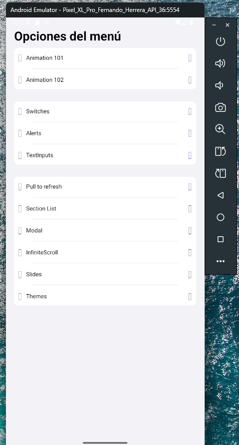

# 📱 React Native ComponentsApp Showcase


This project was built with **React Native**.  
It is an interactive catalog of components and utilities to **accelerate mobile development with React Native**, featuring examples of navigation, animations, switches, modals, inputs, and theme management (dark/light).

## 📸 Screenshots

<p align="center">
  
  
  
</p>

## 🛠️ Tech Stack

- ⚛️ **React Native** – Cross-platform mobile development (iOS/Android).
- 🟦 **TypeScript** – Static typing and robust code structure.
- 🧭 **React Navigation** – Smooth stack navigation and transitions.
- 🎨 **Context API + Hooks** – Global theme management (dark/light mode).
- ✨ **Animations** – Custom hooks (`useAnimation`) with practical examples.
- 🖼️ **Reusable UI Components** – Buttons, Cards, Switches, Custom Views, etc.

## 📂 Project Structure

src
├── config
│ ├── adapters
│ └── theme
├── presentation
│ ├── assets
│ ├── components
│ │ └── ui
│ ├── context
│ ├── hooks
│ ├── icons
│ ├── navigator
│ └── screens
│ ├── alerts
│ ├── animations
│ ├── home
│ ├── inputs
│ ├── switches
│ ├── theme
│ └── ui
└── ComponentsApp.tsx

## 🚀 Installation & Run

1. Clone the repository:

```bash
git clone https://github.com/your-username/07-componentsApp.git
cd 07-componentsApp

---
```

2. Install dependencies:

---

```

yarn install

# or with npm

npm install

---
```

3. Run on Android:

---

```
npx react-native run-android

---
```

4. Run on iOS (requires Mac with Xcode):

---

```

npx pod-install ios
npx react-native run-ios

---
```

## 📌 Features

HomeScreen: entry point to all component demos.

UI Components: Buttons, Cards, Lists, Inputs, and custom UI.

Animations: Animation 101/102 using useAnimation hook.

Theme Switcher: live dark/light theme switching.

Prompts & Alerts: integrated with react-native-prompt-android.

Navigation: implemented with React Navigation + Context.

## 📖 Key Learnings

Modular architecture with config and presentation separation.

Creation of custom hooks for animations and state handling.

Usage of Context API for global theme management.

Implementation of scalable, reusable UI components.

## 👨‍💻 Author

Guillermo Ignacio Varela Barros
LinkedIn · GitHub

## 📝 License

This project is licensed under the MIT License.
You are free to use, modify, and distribute this project.
